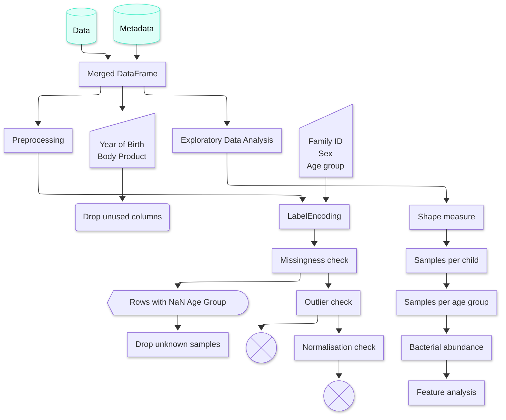

# Documentation

## UML activity diagram

## Important variables and objects

| Name                                         | Purpose                                                                                                                                                                                        |
|----------------------------------------------|------------------------------------------------------------------------------------------------------------------------------------------------------------------------------------------------|
| `data`, `metadata`                           | Raw abundance table and sample metadata loaded from `../data/raw/MAI3004_lucki_mpa411.csv` and `../data/raw/MAI3004_lucki_metadata_safe.csv`; shapes asserted at `(6903, 932)` and `(930, 6)`. |
| `sample_cols`                                | List of abundance columns prefixed with `mpa411_`, used to isolate sample-level measurements.                                                                                                  |
| `sample_abundances`                          | Transposed abundance table keyed by `sample_id`, created from `sample_cols` and `clade_name`.                                                                                                  |
| `metadata_common`                            | Subset of metadata with sample IDs present in `sample_abundances`.                                                                                                                             |
| `merged_samples`                             | Inner merge of `metadata_common` and `sample_abundances`; drops `year_of_birth` and `body_product`.                                                                                            |
| `encoded_samples`                            | Copy of `merged_samples` with `sex` and `family_id` encoded and rows missing `age_group_at_sample` removed.                                                                                    |
| `age_encoder`, `age_groups`                  | `LabelEncoder` fitted on `age_group_at_sample`; `age_groups` maps age group labels to encoded integers.                                                                                        |
| `missing_table`                              | Summary of missing values per column in `encoded_samples`, including percentage of missing data.                                                                                               |
| `numeric_cols`, `outlier_table`              | Numeric column list and corresponding IQR-based outlier bounds/counts.                                                                                                                         |
| `normalized_samples`                         | Copy used for Shapiro-Wilk normality checks across `numeric_cols`.                                                                                                                             |
| `X`, `feature_cols`                          | Feature matrix derived from `merged_samples` after removing metadata columns; drives prevalence and PCA analysis.                                                                              |
| `top_features`, `X_sub`, `X_scaled`, `X_pca` | PCA prep artifacts: top 500 prevalent features, their subset matrix, scaled values, and resulting 2D projection.                                                                               |
