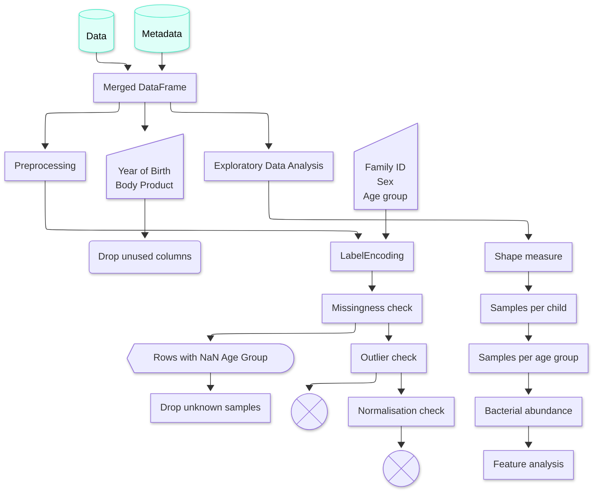

# Data Analysis Pipeline for Microbial Community Profiling

[](https://opensource.org/licenses/MIT)
[](https://www.python.org/downloads/)

## Overview

This repository contains a comprehensive data analysis pipeline for processing and analyzing MetaPhlAn 4 microbial abundance data from the LuCKi cohort study. The pipeline includes exploratory data analysis, preprocessing, feature engineering, and multiple machine learning models for predicting age from gut microbiome composition.

### Key Features

- **Data Processing**: Automated pipeline for MetaPhlAn 4.1.1 taxonomic profile data
- **Exploratory Data Analysis**: Comprehensive statistical analysis and visualization
- **Feature Engineering**: Taxonomic level filtering, prevalence-based selection, and neural network-based feature selection
- **Machine Learning Models**: XGBoost, Random Forest, LightGBM, Gradient Boosting, AdaBoost, and TensorFlow neural networks
- **Model Interpretability**: LIME and SHAP explanations for model predictions
- **Cross-Validation**: Repeated k-fold cross-validation for robust performance estimation

### Data Source

This analysis uses data from the **LuCKi Living Lab cohort study**:
- **Citation**: Lucki Cohort Study Group (2015). "The LuCKi Living Lab - An Innovative Epidemiological Approach to Study the Gut Microbiome Over the Lifespan." *BMC Public Health*. DOI: [10.1186/s12889-015-2255-7](https://doi.org/10.1186/s12889-015-2255-7)
- **Data Format**: MetaPhlAn 4.1.1 taxonomic profiles with sample metadata

## Installation

### Prerequisites

- Python 3.8 or higher
- pip package manager
- (Optional) CUDA-capable GPU for TensorFlow acceleration

### Setup Instructions

1. **Clone the repository**:
   ```bash
   git clone https://github.com/MAI-David/Data-analysis.git
   cd Data-analysis
   ```

2. **Create a virtual environment** (recommended):
   ```bash
   python -m venv venv
   source venv/bin/activate  # On Windows: venv\Scripts\activate
   ```

3. **Install dependencies**:
   ```bash
   pip install -r notebooks/requirements.txt
   ```

4. **Verify installation**:
   ```bash
   python -c "import pandas, numpy, sklearn, tensorflow; print('All dependencies installed successfully')"
   ```

## Usage

### Quick Start

1. **Place your data** in the `data/raw/` directory:
   - MetaPhlAn abundance table: `MAI3004_lucki_mpa411.csv`
   - Sample metadata: `MAI3004_lucki_metadata_safe.csv`

2. **Open the Jupyter notebook**:
   ```bash
   cd notebooks
   jupyter notebook data-pipeline.ipynb
   ```

3. **Run the analysis** by executing cells sequentially.

### Pipeline Structure

The analysis pipeline follows these main steps:

1. **Data Loading and Merging**: Load abundance and metadata, merge on sample IDs
2. **Preprocessing**: Handle missing values, encode categorical variables
3. **Exploratory Data Analysis**: Statistical summaries, distributions, correlations
4. **Feature Engineering**: Taxonomic filtering, prevalence-based selection
5. **Model Training**: Train and evaluate multiple ML models
6. **Model Interpretation**: Generate LIME and SHAP explanations
7. **Performance Evaluation**: Cross-validation and residual analysis

### Reproducibility

All random seeds are set to ensure reproducible results:
- Random seed: `42` (Python random, NumPy)
- Random seed: `3004` (cross-validation, some models)
- TensorFlow seed: `42`

To reproduce the analysis:
```python
from notebooks.functions import set_global_seeds
set_global_seeds(seed=42)
```

## Repository Structure

```
Data-analysis/
├── README.md                 # This file
├── LICENSE                   # MIT License
├── CITATION.cff             # Citation information
├── .gitignore               # Git ignore patterns
├── data/
│   └── raw/                 # Raw data files (not tracked in Git)
│       ├── MAI3004_lucki_mpa411.csv
│       ├── MAI3004_lucki_metadata_safe.csv
│       └── metaphlan411_data_description.md
└── notebooks/
    ├── requirements.txt     # Python dependencies
    ├── functions.py         # Reusable functions and models
    └── data-pipeline.ipynb  # Main analysis notebook
```

## Data Format

### MetaPhlAn 4 Abundance Data

- **Format**: Tab-separated values (TSV) or CSV
- **Structure**: Rows = taxonomic features (clades), Columns = samples
- **Values**: Relative abundances (percentages)
- **Taxonomic Notation**: `k__|p__|c__|o__|f__|g__|s__|t__` (Kingdom to SGB)

See `data/raw/metaphlan411_data_description.md` for detailed format specifications.

### Metadata

Required columns:
- `sample_id`: Unique sample identifier
- `age_group_at_sample`: Age group label (target variable)
- `sex`: Biological sex
- `family_id`: Family identifier

## Functions and Models

The `functions.py` module provides:

### Core Functions
- `set_global_seeds()`: Set random seeds for reproducibility
- `nn_feature_search()`: Neural network-based feature selection
- `xgboost_benchmark()`, `random_forest_benchmark()`, etc.: Model training functions
- `final_battle()`: Repeated cross-validation across multiple models

### Feature Engineering
- `get_taxonomic_level()`: Extract taxonomic level from feature names
- `filter_features_by_level()`: Filter features by taxonomic depth
- `cross_validate_feature_cutoffs()`: Test performance across taxonomic levels

### Model Interpretation
- `explain_with_lime()`: Generate LIME explanations
- `explain_with_shap()`: Generate SHAP explanations

### Visualization
- `plot_feature_cutoff_comparison()`: Compare performance by taxonomic level
- `plot_residuals_analysis()`: Comprehensive residual diagnostics
- `plot_learning_curves()`: Bias-variance analysis

## Hardware Considerations

- **CPU**: All models can run on CPU
- **GPU**: TensorFlow neural networks support GPU acceleration
  - ROCm support included for AMD GPUs
  - CUDA required for NVIDIA GPUs
- **Memory**: ~8GB RAM recommended for full dataset

## Contributing

Contributions are welcome! Please:

1. Fork the repository
2. Create a feature branch (`git checkout -b feature/improvement`)
3. Commit your changes (`git commit -am 'Add new feature'`)
4. Push to the branch (`git push origin feature/improvement`)
5. Open a Pull Request

## Citation

If you use this code in your research, please cite:

```bibtex
@software{mai_david_data_analysis,
  author = {MAI-David},
  title = {Data Analysis Pipeline for Microbial Community Profiling},
  year = {2026},
  url = {https://github.com/MAI-David/Data-analysis},
  version = {1.0.0}
}
```

And cite the original data source:
```bibtex
@article{lucki2015,
  title={The LuCKi Living Lab - An Innovative Epidemiological Approach to Study the Gut Microbiome Over the Lifespan},
  journal={BMC Public Health},
  year={2015},
  doi={10.1186/s12889-015-2255-7}
}
```

## License

This project is licensed under the MIT License - see the [LICENSE](LICENSE) file for details.

## Contact

For questions or issues, please open an issue on GitHub.

---

## Technical Documentation

## UML activity diagram



## Important variables and objects

| Name                                         | Purpose                                                                                                                                                                                        |
|----------------------------------------------|------------------------------------------------------------------------------------------------------------------------------------------------------------------------------------------------|
| `data`, `metadata`                           | Raw abundance table and sample metadata loaded from `../data/raw/MAI3004_lucki_mpa411.csv` and `../data/raw/MAI3004_lucki_metadata_safe.csv`; shapes asserted at `(6903, 932)` and `(930, 6)`. |
| `sample_cols`                                | List of abundance columns prefixed with `mpa411_`, used to isolate sample-level measurements.                                                                                                  |
| `sample_abundances`                          | Transposed abundance table keyed by `sample_id`, created from `sample_cols` and `clade_name`.                                                                                                  |
| `metadata_common`                            | Subset of metadata with sample IDs present in `sample_abundances`.                                                                                                                             |
| `merged_samples`                             | Inner merge of `metadata_common` and `sample_abundances`; drops `year_of_birth` and `body_product`.                                                                                            |
| `encoded_samples`                            | Copy of `merged_samples` with `sex` and `family_id` encoded and rows missing `age_group_at_sample` removed.                                                                                    |
| `age_encoder`, `age_groups`                  | `LabelEncoder` fitted on `age_group_at_sample`; `age_groups` maps age group labels to encoded integers.                                                                                        |
| `missing_table`                              | Summary of missing values per column in `encoded_samples`, including percentage of missing data.                                                                                               |
| `numeric_cols`, `outlier_table`              | Numeric column list and corresponding IQR-based outlier bounds/counts.                                                                                                                         |
| `normalized_samples`                         | Copy used for Shapiro-Wilk normality checks across `numeric_cols`.                                                                                                                             |
| `X`, `feature_cols`                          | Feature matrix derived from `merged_samples` after removing metadata columns; drives prevalence and PCA analysis.                                                                              |
| `top_features`, `X_sub`, `X_scaled`, `X_pca` | PCA prep artifacts: top 500 prevalent features, their subset matrix, scaled values, and resulting 2D projection.                                                                               |
